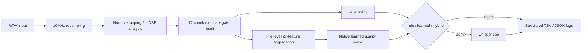

# C++ Edge Audio Quality Gate

Linux-first C++/Python audio-admission pipeline around [whisper.cpp](vendor/whisper.cpp). It measures audio quality before ASR so low-value audio does not consume Whisper compute. The runtime combines an interpretable DSP gate with a native export of a trained gradient-boosting quality model; Python is used for dataset, training, and offline evaluation tooling only.

## Architecture


```mermaid
flowchart LR
    WAV[WAV input] --> RESAMPLE[16 kHz resampling]
    RESAMPLE --> CHUNKS[Non-overlapping 5 s DSP analysis]
    CHUNKS --> METRICS[12 chunk metrics + gate result]
    METRICS --> AGG[File-level 27-feature aggregation]
    METRICS --> RULE[Rule policy]
    AGG --> LEARNED[Native learned quality model]
    RULE --> POLICY{rule / learned / hybrid}
    LEARNED --> POLICY
    POLICY -->|admit| ASR[whisper.cpp]
    POLICY -->|reject| LOGS[Structured TSV / JSON logs]
    ASR --> LOGS
```

The learned model scores one completed WAV, not individual chunks. Rule policy is the default. Learned and hybrid policies run Whisper zero or one time per complete WAV after the file-level decision.

## Engineering milestones

- Baseline interpretable DSP rule gate with FFT-derived chunk metrics.
- Dataset and evaluation audit, including leakage and threshold-metadata correction.
- Disjoint train/validation/test protocol with threshold selection on validation only.
- `sklearn.ensemble.GradientBoostingClassifier` training on one complete-file 27-feature vector.
- Deterministic, dependency-free C++ tree export.
- Python/C++ numerical parity verification.
- Runtime file-level learned and hybrid admission integration.

## Verified results

Frozen held-out feature-table evaluation, 1,700 examples. ASR calls mean one file-level call per admitted example; Whisper was not run for this table evaluation.

| Policy | TP | FP | TN | FN | F1 | ASR calls | Calls avoided |
|---|---:|---:|---:|---:|---:|---:|---:|
| Rule baseline | 957 | 416 | 284 | 43 | 0.8066 | 1,373 | 19.24% |
| Learned | 986 | 157 | 543 | 14 | 0.9202 | 1,143 | 32.76% |
| Hybrid heuristic | 944 | 127 | 573 | 56 | 0.9116 | 1,071 | 37.00% |


Native export/parity results:

- 100 depth-3 trees, 1,488 nodes, 27 ordered features.
- 3,400/3,400 Python/C++ decision agreement.
- Maximum raw-score difference: 0.
- Maximum probability difference: `1.1102230246251565e-16`.
- Compiled model data: 36,112 bytes.
- Recorded export benchmark: about 1.21 million predictions/second.

Runtime measurements on the integration build:

- Aggregation: 43.7 ns/chunk.
- Native model: 0.894 microseconds mean, 0.902 microseconds p95.
- Whole-file Whisper smoke: about 417–439 ms.

These are three distinct scopes: the frozen table above, a 1,300-WAV native runtime subset, and a real Whisper smoke test. The native subset excludes 400 FLAC inputs because the current runtime accepts WAV. See [runtime integration results](reports/quality_gate_runtime_integration.md) for the full distinction and limitations.

## Setup

The environment defined by environment.yml is named audio_king.

```bash
conda activate audio_king
git submodule update --init
```

The runtime is C++17/CMake and expects `vendor/whisper.cpp`. CPU is the default:

```bash
cmake -S runtime/cpp -B runtime/cpp/build \
  -DCMAKE_BUILD_TYPE=Release \
  -DWHISPER_ROOT="$PWD/vendor/whisper.cpp" \
  -DBUILD_TESTS=ON
cmake --build runtime/cpp/build -j"$(nproc)"
```

For an optional CUDA build, configure the same supported CMake project with `-DGGML_CUDA=ON`:

```bash
cmake -S runtime/cpp -B runtime/cpp/build \
  -DCMAKE_BUILD_TYPE=Release \
  -DWHISPER_ROOT="$PWD/vendor/whisper.cpp" \
  -DGGML_CUDA=ON
cmake --build runtime/cpp/build -j"$(nproc)"
```

## Build and test

The repository test script configures `runtime/cpp/build_tests`, builds the native targets, and runs CTest:

```bash
bash scripts/run_tests.sh Release
```

To run the supported Python workflow test:

```bash
conda activate audio_king
python -m pytest tests/python/test_quality_workflow.py -v
```

Focused native checks after the test build:

```bash
runtime/cpp/build_tests/test_quality_gate_runtime
runtime/cpp/build_tests/quality_model_parity \
  runtime/cpp/tests/data/quality_model_neura_v1_parity.bin
```

## Demo

The included JFK fixture and local tiny English Whisper model make a self-contained demo when the submodule models are present:

```bash
WAV=vendor/whisper.cpp/samples/jfk.wav
MODEL=vendor/whisper.cpp/models/ggml-tiny.en.bin
BIN=runtime/cpp/build/audio_pipeline

"$BIN" --input "$WAV" --model "$MODEL" --quality-policy rule
"$BIN" --input "$WAV" --model "$MODEL" --quality-policy learned --quality-threshold 0.3
"$BIN" --input "$WAV" --model "$MODEL" --quality-policy hybrid --quality-threshold 0.3
```

The alternate threshold below is a CLI demonstration only; `0.3` remains the frozen validation-selected threshold.

```bash
"$BIN" --input "$WAV" --model "$MODEL" \
  --quality-policy learned --quality-threshold 0
```

Write a JSON benchmark/log record with the implemented `--bench-json` option:

```bash
"$BIN" --input "$WAV" --model "$MODEL" \
  --quality-policy learned --quality-threshold 0.3 \
  --bench-json /path/to/private/quality-learned.json
```

For all three modes with separate TSV, JSON, stdout, and stderr files:

```bash
scripts/demo_quality_gate.sh "$WAV" "$MODEL"
```

The model argument is optional. Without it, the script runs each policy with `--gate-only`, preserving gate/logging demonstration while cleanly skipping real ASR.

## Robot Hearing Loop

`robot_hearing_demo` converts raw S16LE stdin into completed utterances, applies
the existing DSP and ordered 27-feature quality analysis, admits each utterance
with rule, learned, or hybrid policy, runs Whisper zero or one time, routes only
canonical commands, and emits one robot-facing JSON event. Learned and hybrid
inference occur only after utterance finalization.

The presentation-safe path is deterministic replay with
`ggml-base.en.bin` on CUDA and rule policy. `ggml-tiny.en.bin` is the
lower-resource fallback. Private command recordings and model binaries remain
local and are not committed.

```bash
REPO="$(pwd)"
RULE_FIXTURE="/path/to/private/command-sequence.wav"
RESULTS_DIR="/path/to/private/results"

"$REPO/scripts/benchmark_robot_hearing_replay.sh" \
  --input "$RULE_FIXTURE" \
  --demo "$REPO/runtime/cpp/build/robot_hearing_demo" \
  --model "$REPO/vendor/whisper.cpp/models/ggml-base.en.bin" \
  --model-label base.en \
  --quality-policy rule \
  --output-dir "$RESULTS_DIR"
```

The supported commands are `stop`, `go forward`, `go backward`, `turn left`,
and `turn right`. Normalization handles case, surrounding whitespace, repeated
whitespace, and ordinary terminal punctuation; malformed or noncanonical
transcripts remain `UNKNOWN` with a null action.

iPhone Continuity streaming is experimental. Start with five seconds of silent
capture, say compound commands continuously without pausing between words, and
leave about two seconds between commands. Rule policy is recommended for live
presentation. Learned policy remains available only at the frozen threshold
`0.3`; it is not calibrated for short live commands and showed variable pilot
admission.

`post_utterance_ms` starts after the segmenter finalizes an utterance. It covers
completed-utterance processing and is not full microphone-to-action latency.

See the [presentation runbook](docs/robot_hearing_demo.md), [technical
validation](docs/robot_hearing_validation.md), and [interview
notes](docs/robot_hearing_interview_notes.md).

## Limitations

- The evaluation data is class-balanced and substantially synthetic; metrics do not estimate production prevalence.
- Music and stationary noise remain the largest learned-model false-accept categories.
- Hybrid is a conservative heuristic, not a separately trained model.
- Learned inference requires a completed file-level vector; VAD and packed-VAD remain rule-only.
- Live learned scoring is valid only after explicit utterance segmentation.
- The iPhone Continuity work is a small cross-device pilot, not a deployment-domain benchmark.
- The command router is deterministic, not neural NLU; scene classification is
  informational and can misclassify. There is no calibrated iPhone microphone
  array or DOA claim, and cross-device results are not a production benchmark.

See [quality model protocol](reports/quality_model_neura_v1.md), [native parity](reports/quality_model_cpp_parity.md), and [runtime integration](reports/quality_gate_runtime_integration.md) for reproducibility details.
