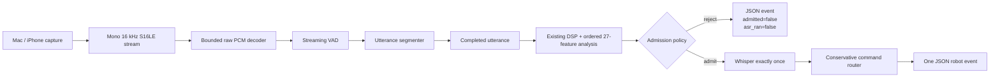

# Robot Hearing technical validation

## Scope and acceptance

The core Robot Hearing system is accepted for deterministic GPU replay. The
iPhone Continuity path is an experimental extension: controlled startup now
produces the expected event count, but live transcription accuracy remains too
variable to claim reliable five-command robot control.

Measured evidence below is kept separate from interpretation. The model table
is a pilot result from three recordings and fifteen expected command positions,
not a statistical ASR benchmark.

## Test environment

- ASUS ROG Zephyrus G14 running the Linux runtime.
- NVIDIA RTX 3060 Laptop GPU, CUDA architecture 86.
- Explicit CUDA device 0 (`CUDA0`), with CPU fallback disabled.
- iPhone Continuity microphone captured by a Mac and streamed to Linux over
  SSH as mono 16 kHz S16LE PCM.
- Release C++ build using the existing whisper.cpp backend.

Private recordings and model binaries were local validation assets and are not
committed.

## Architecture

The streaming path preserves the existing file-equivalent DSP, 27-feature
ordering, quality policies, scene classifier, Whisper wrapper, and JSON event
protocol. Quality inference receives only a completed utterance.

The rejection branch bypasses Whisper. An admitted malformed transcript still
produces an event, but the router returns `UNKNOWN` and a null action.

## Deterministic model benchmark

The same three recordings were replayed identically for both models. The table
covers fifteen expected command positions.

| Model | Routed accuracy | Mean ASR | Median ASR | p95 ASR |
|---|---:|---:|---:|---:|
| tiny.en | 7/15 | 32.3 ms | 16.0 ms | 115.9 ms |
| base.en | 12/15 | 40.4 ms | 23.8 ms | 120.7 ms |

Interpretation: base.en materially improved routed-command accuracy in this
pilot for a modest measured GPU-latency increase. This does not establish
general ASR accuracy, confidence intervals, or performance on other speakers,
devices, environments, or languages.

## Quality admission findings

- The learned threshold remains frozen at `0.3`.
- Deterministic identical-audio replays produced stable learned probabilities.
- Admission varied across live captures.
- Direct completed-buffer analysis matched the existing file-analysis path
  across all 27 ordered features.
- The learned gate must not be described as calibrated for short live robot
  commands. Poor calibration can reject valid commands even when Whisper could
  have transcribed them.

Rule policy is therefore the presentation recommendation. Learned policy is an
optional technical demonstration of completed-utterance admission, not the
primary live gate.

## Segmentation investigation

The streaming endpoint remains 600 ms. One pilot recording contained a real
740 ms acoustic pause inside the expected phrase “turn right.” Production VAD
therefore supplied 37 consecutive non-speech frames, and the segmenter
correctly finalized after its configured 30-frame endpoint.

An offline end-silence-only study showed that 760–800 ms would avoid that
specific split while adding 160–200 ms of endpoint latency. Three recordings
are insufficient tuning evidence, so no parameter changed. Compound commands
should be spoken as continuous phrases.

## Startup and transport investigation

The live helper launches FFmpeg and SSH concurrently. The remote executable
loads Whisper before it begins consuming stdin, and the current path has no
explicit capture-ready handshake.

For diagnosis, one FFmpeg capture was duplicated through `tee`: the exact raw
bytes written locally were the bytes sent to SSH. The Mac and Linux checksums
matched. A five-second silent warm-up produced five events, and replaying the
identical bytes through the same CUDA executable reproduced every event
boundary, duration, transcript, intent, and action. A second warm-up capture
again produced five events.

The first command in the traced capture:

- began VAD activity at 4.86 s;
- reached the normal two-frame trigger;
- accumulated 30 speech frames against a ten-frame minimum;
- finalized after 30 non-speech frames; and
- emitted normally.

No transport-loss, streaming-VAD, minimum-duration, or live-versus-replay
nondeterminism defect was found. The warm-up is justified operational guidance;
an explicit future readiness handshake would make that state observable.

## Live acceptance

The startup event-count symptom is resolved by the controlled warm-up, but live
ASR remains variable. Several valid utterances produced malformed transcripts
such as partial or substituted command words. The conservative router correctly
left those events `UNKNOWN`.

Consequently:

- do not claim reliable five-command live control;
- do not call an `UNKNOWN` result from malformed ASR text a router defect; and
- keep deterministic replay as the primary presentation path.

## Verification

- Release CUDA build completed with `GGML_CUDA=ON`.
- CUDA0 was active and `cpu_fallback=no`.
- Complete unfiltered CTest passed 9/9.
- JSONL stdout parsed successfully; diagnostics remained on stderr.
- Each admitted utterance invoked ASR exactly once.
- Rejected utterances invoked ASR zero times.
- Malformed transcripts produced `UNKNOWN` and a null action.
- The existing `audio_pipeline` executable and file-analysis path remain
  available and unchanged.

`post_utterance_ms` starts when a completed utterance enters quality analysis.
It includes completed-utterance processing, ASR when admitted, routing, and
event construction. It excludes capture time, active speech duration, endpoint
waiting, transport setup, and model initialization, so it is not full
microphone-to-action latency.

## Known limitations and future work

- The model comparison is a fifteen-command pilot.
- Live command ASR accuracy is not yet presentation-reliable.
- The learned gate needs a larger labeled live-command calibration corpus.
- Scene classification is informational and was not used for routing.
- Endpoint tuning needs examples of both natural internal pauses and closely
  spaced commands.
- A capture-ready handshake should distinguish model, transport, and audio
  readiness.
- Full capture-to-action latency needs timestamped instrumentation across the
  capture and Linux hosts.
- A future ROS2 adapter requires explicit action allowlists, timeouts, and
  safety interlocks.

See the [presentation runbook](robot_hearing_demo.md) for commands and the
[interview notes](robot_hearing_interview_notes.md) for a concise technical
narrative.
